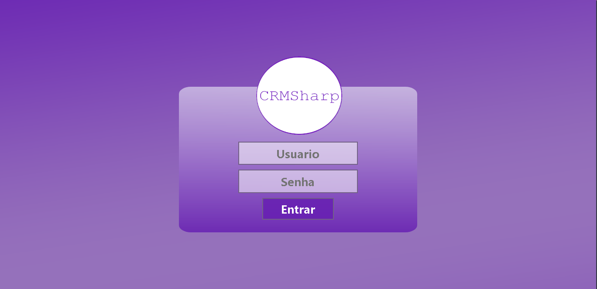
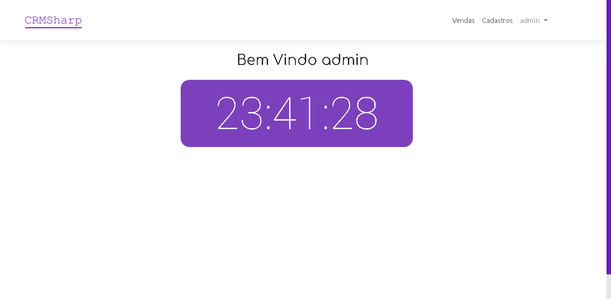
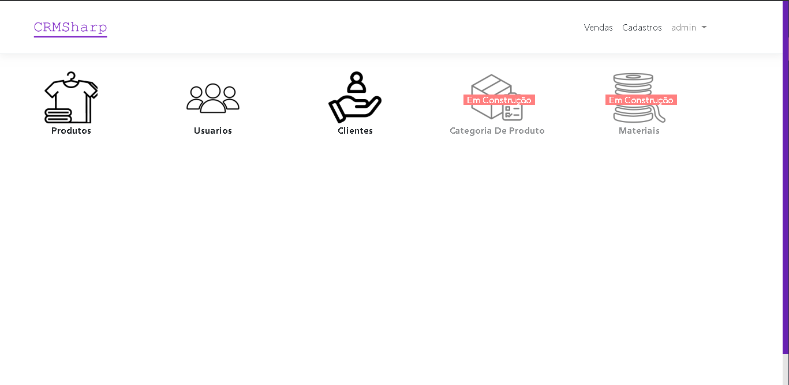
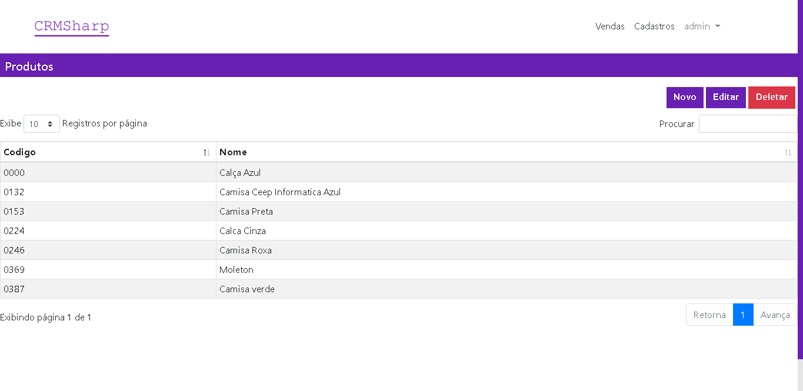
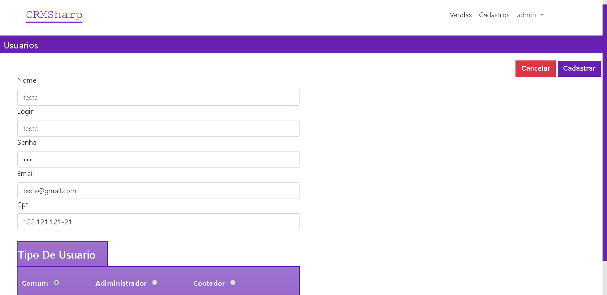
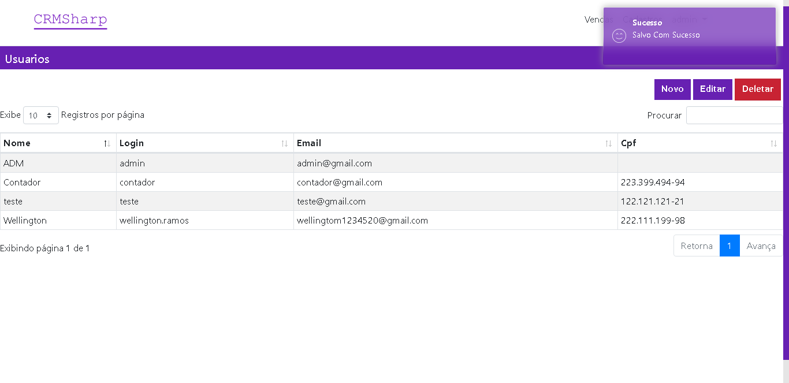
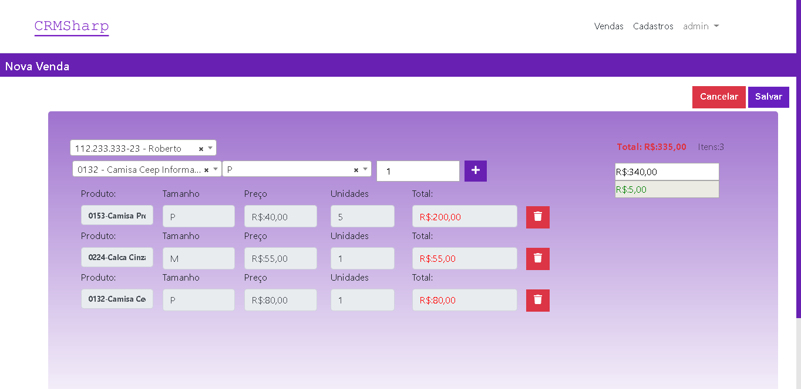
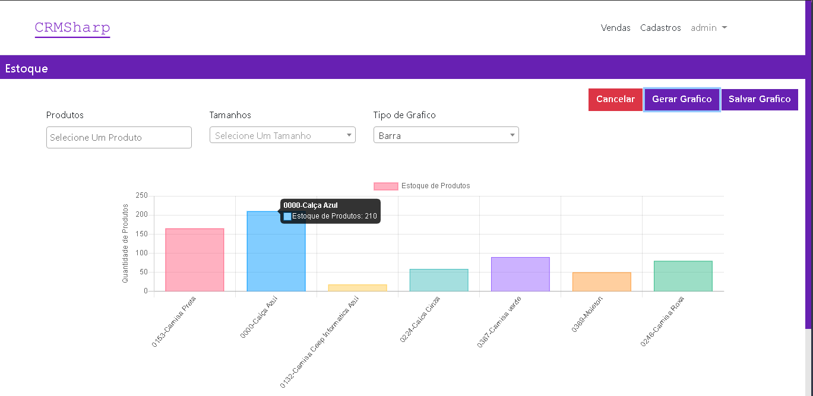
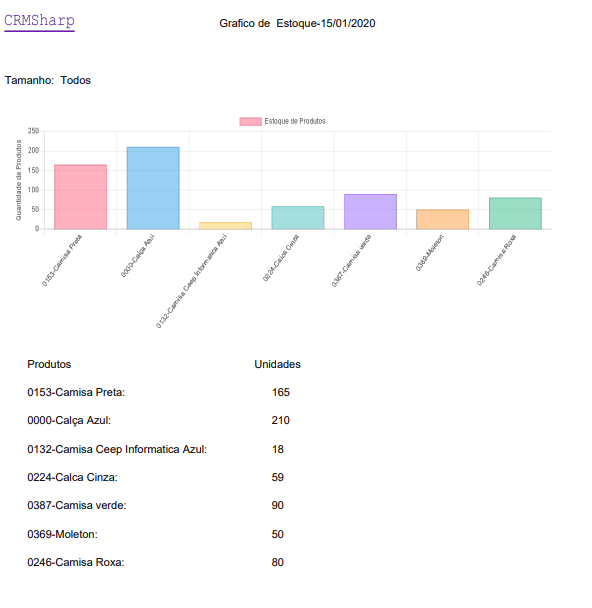

# CRMCSharp
 Um software desenvolvido em c#,se trata de um ERP/CRM web
 ### Para Testar
    Requisitos:
    - dotnet 2.2
    - mysql
 > Crie um Banco com o seguinte nome: CrmSharp   

 # Execute os Seguintes comandos
    - dotnet ef database update (Apenas a primeira vez que o banco é criado)
    - dotnet run
    - Usuario: admin
    - Senha: admin
# Fotos Demostrativas

- login
</img>

- Home
</img>

- Cadastros
</img>

- Produtos
</img>

- Usuario
</img>

- Alerta De Salvamento
</img>

- Venda
</img>

- Graficos De Estoque
</img>
 
<strong>Pdf De Estoque</strong>
</img>